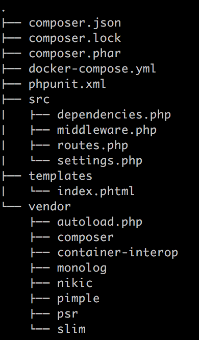
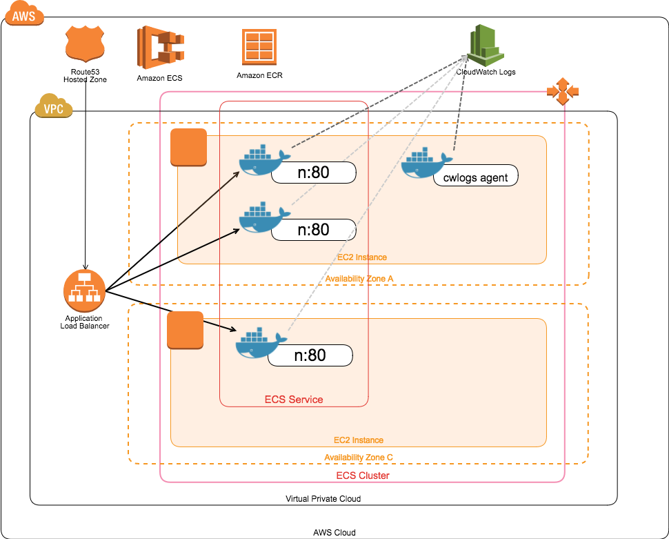
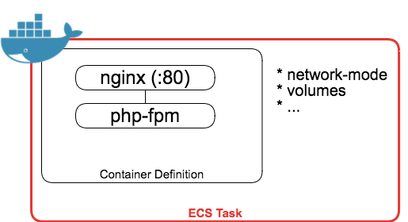
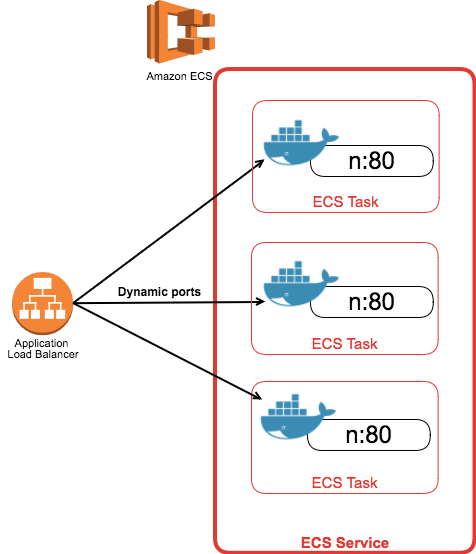
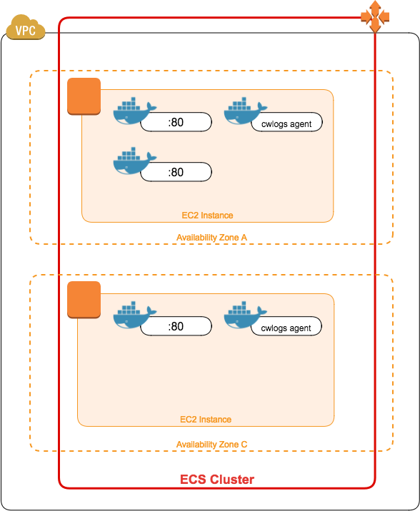
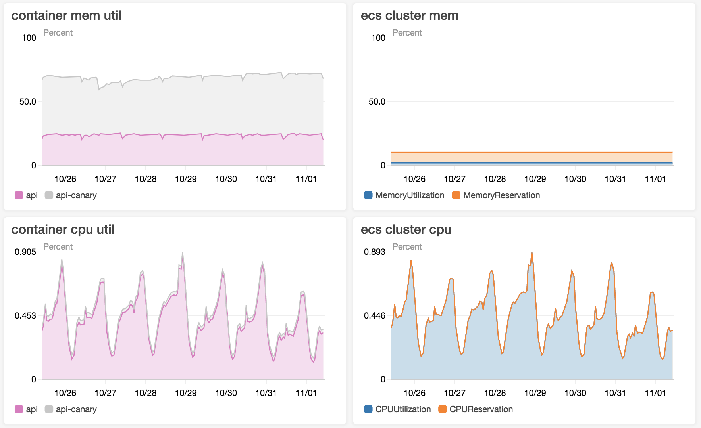
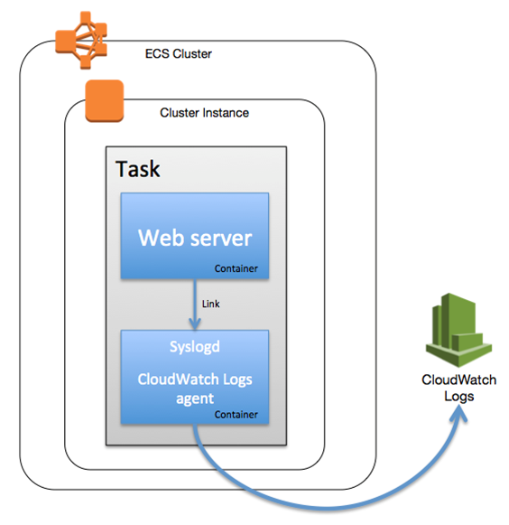
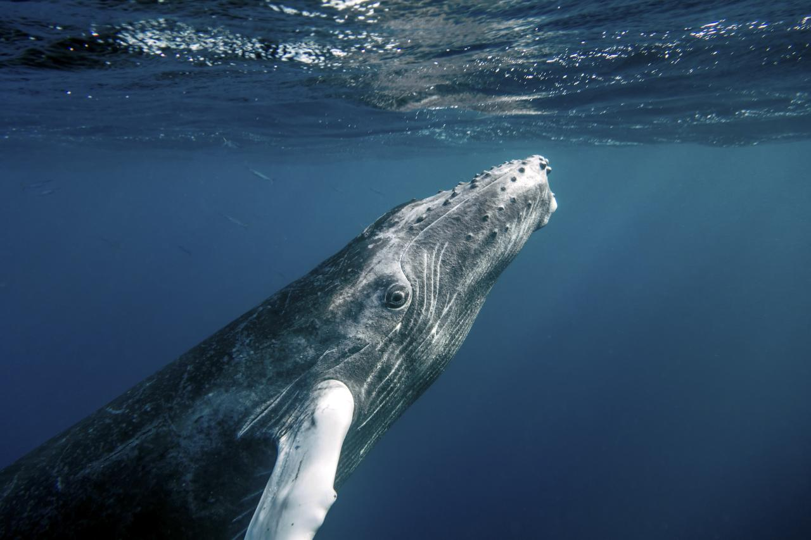

theme: Plain Jane, 1
build-lists: true
footer: Docker Cluster Strategy - @_nishigori \#phpcon2017 \#再演
slidenumbers: true

# [fit] Container Cluster Strategy

# *~ How design for the PHP web application? ~*

 

----
## Who are you?

![inline left 25%][twitter-icon]　Twitter: **@_nishigori**

- VOYAGE GROUP, Inc. SREえんじにゃー
- 元々アプリケーション書いてて徐々にM/W等下に降りてった人
- PHPはひたすらバージョン上げたり、OPcache最適化図ったり

[twitter-icon]: https://pbs.twimg.com/profile_images/708151141201149954/wLdssamL_400x400.jpg

----
## Agenda

- What Docker  / Container ?
- Orchestration
- Build & Deployment
- Capacity Planning (& Monitoring)
- History & Future

----
# [fit] What Docker?

----
# What Docker?


> **Docker is the world's leading software containerization platform.**

-- https://www.docker.com/what-docker

----
### **「こんてなりぜーしょん」**

### **「ぷらっとふぉーむ」**


----
# What is the meaning of **platform**?

## [fit] **Kernel[^1] の機能や様々なライブラリを利用してコンテナを動かしている**

containerd & runC, rkt,
Cgroups, Storage, Namespaces, Networking, Security
pivot_root, chroot, etc ...

## [fit] **＝ ひとつの技術だけではない・ひとつひとつは代替可能**


[^1]: この発表ではLinux上のDockerについてのみ言及

----
# What is the meaning of **platform**?

**Code as:** DockerfileでContainer Imageをどのように構築されるか表現

```Dockerfile
# Dockerfile
FROM nginx:alpine

RUN rm -f /etc/nginx/conf.d/*.conf
ADD nginx.conf /etc/nginx/nginx.conf
RUN nginx -t

EXPOSE 80
```


----
# What is the meaning of **containerize**?

コンテナを扱うためのインターフェースが揃っている

`$ docker pull / push / build / run / image / container / ...`


----
# [fit] What Container?

----
## What Container?

### > Package software into standardized units for development, shipment and deployment

> A container image is a lightweight, stand-alone, executable package of a piece of software that includes everything needed to run it: code, runtime, system tools, system libraries, settings.

-- https://www.docker.com/what-container


----
### [fit] **「こんてな」**


----
# **PHPに当てはめてみる**


----
> [^2] ... executable package of a piece of software that includes everything needed to run it: ...

[^2]: https://www.docker.com/what-container より引用

----
# needed to run it: **runtime**

![inline][php-elephant] ![inline][php-elephant] ![inline][php-elephant] ![inline][php-elephant] ![inline][php-elephant]

![inline][php-elephant] ![inline][php-elephant] ![inline][php-elephant] ![inline][php-elephant] ![inline][php-elephant]

[php-elephant]: https://www.webmaster-hub.com/publications/wp-content/uploads/2003/08/www.webmaster-hub.compublicationIMGarton3-a7000aef44694ac502439c1bf122154b9b24e2fe.gif

----
## needed to run it: **system tools, system libraries**

libxml / libicu / openssl / libcurl / ...

## needed to run it: **settings**

php.ini / www.conf for php-fpm / ...

ports? / memory limit / cpu unit / ...

----
# needed to run it: **code**

* Your code
  * e.g. GitHub repository code
* Dependencies code
  * e.g. from composer libraries



----
あなたのPHPアプリケーションの `needed run it: *` を把握しContainer Imageを作成する

曰く:

* **stand-alone** （container runtimeさえあれば大丈夫そうだ）
* **lightweight**（必要なものしか入っていない）
* **executable package** （必要なものは全て揃ったぞぃ）

----
### [fit] **「デモしてみよ」**


----
### [fit] **「こんてな、すごーい」**


----
# [nits] Docker Build Pattern for PHP

* Links container memory ...
  * `memory_limit`
  * `opcache.memory_consumption`
* `opcache.validate_timestamps=0`
  * （恐らく）リリースは常にコンテナの入れ替えなので、php fileの更新日時を見る必要はない

----
# [fit] Orchestration

 

----
# [fit] What is Orchestration

* スケジューリング
* スケール
* プロビジョニング
* 自動デプロイ
* クラスター管理
* etc ...


----
# Orchestration

**Public cloud provider:**

* Amazon EC2 Container Service (ECS)
* Azure Container Service (AKS)
* Docker Enterprise Edition (Docker EE)
* Google Container Service (GKE)

**Open Source:** Docker Swarm / Kuberenes / Marathon / ...

----
### [fit] **「ばなな」**


----
[^3]

OrchestrationはToolによって用語・機能が違うので、これからはAWS ECSを例に話します

### [fit] https://github.com/nishigori/phpcon2017-presentation

[^3]: https://aws.amazon.com/ecs/details/

----


----
# ECS Task

* A group of one or more containers
* 感覚としては `docker-composer up` optionsに近いかも
* GKEでいうPodsの概念に相当



----
# ECS Service

* ECS Task定義で指定された数のコンテナを配置
* + AutoScaling
* Service Load Balancing
  * ホスト上にコンテナのポートを自動割り当て



----
# ECS Cluster

* ECS Taskを配置するコンテナインスタンスの論理グループ
  * EC2 AutoScaling Group
  * EC2 Instance(s)
* +AutoScaling



----
# ECS Cluster

**Q. Which one should we choose Host OS?**
A. 実にたくさんある…

(AWS) Amazon ECS Optimized AMI
Container-Optimized OS (Google)
ContainerLinux (CoreOS)
Barge OS
etc ...

----
# ECS Cluster

**Q. Which one should we choose Host OS?**

* たくさん考慮していこう
  * Kernel version
  * Docker version
  * Launch time
  * etc ...

----
# ECS Cluster - Containerとの釣り合い

* Memory / CPU Reservation
* Memory / CPU Usage

`docker run --mem=1024m ...`



----


----
# Deployment

----
# Deployment - rolling update

1. 新しいコンテナの立ち上げ
1. ELBからサービスイン
1. 古いコンテナを破棄

を繰り返して全コンテナを入れ替えていく

----
# Deployment - rolling update

<br>

### [fit] demo?

----
# Deployment for **Ops (team)**

## [fit] ~ rolling update to the ECS Cluster ~

* **Drain** containers

----
# Deployment - Canary


-- https://martinfowler.com/bliki/CanaryRelease.html

----
# Deployment - Canary

**Q. どこから切り分ける？**

1. Load Balancer?
1. ECS Cluster?
1. ECS Service?
1. Others?

----
# Deployment - Canary

**Case of Docker EE:**

- Docker EE Release Candidate
- Customer Zero

**正に好きに使えよスタイル**

#### [fit] Detail of dockercon EU 2017 - https://europe-2017.dockercon.com/

----
# Deployment - Container Image Management

## - 割愛 -

----
# Deployment case of PHP

## OPcache / APCu 等、サービスイン前にWarmupしたい

**=> ENTRYPOINT で定義したスクリプト内でごにょごにょしてみよう**

```dockerfile
# Dockerfile
FROM xxx
# ....

ENTRYPOINT ["entrypint-app.sh"]
CMD ["--env", "production"]
```

----
# **Logging**

----
## Logging

コンテナに（基本）データは残さない
logも例外ではない

* Log as data
* エージェントによるPush型
  * fluentd
  * cloudwatch log agent
* いわゆる中央集権型（Centralized logging）



----
## Logging on Dockerfile

https://github.com/nginxinc/docker-nginx/blob/3ba04e3/mainline/stretch/Dockerfile#L91-L93

```dockerfile
# forward request and error logs to docker log collector
RUN ln -sf /dev/stdout /var/log/nginx/access.log \
  && ln -sf /dev/stderr /var/log/nginx/error.log
```

----


----
### [fit] **「AWS ECSつかお」**


----
# **ガッ**[^4]

[^4]: ECSがダメって言ってるんじゃないYo

----
### [fit] **「GKE」**


----
# **ガッ**[^5]

[^5]: GCPがダメって言ってるんじゃないYo

----
### [fit] **「…AKEでがんｂ（ｒｙ**


----
# **ガッ**[^6]

[^6]: AKEがダメって言ってるんじゃないYo

----
# Public Container Serviceは周辺技術も大事[^5]

* (GCP) Load Balancer / BQ / ...
* (AWS) S3 / SNS / SQS / ...
* ...
* SLA?
* Using Reserved Instance?

[^5]: k8sいいよk8s

----
# [fit] **最後に、Docker史とこれから（予測）を少し**



----
## History

```
2013.03~ Docker
2014.06~ Docker Hub
2014.06~ Kubernetes (k8s, kube)
2014.11~ Amazon EC2 Container Service (ECS)
2014.11~ Google Container Engine (GKE)
2014.12~ CoreOS Rocket
2014.12~ Docker Machine / Swarm / Compose
2015.07~ Cloud Native Computing Foundation (CNCF)
2015.08~ VMware vSphere Integrated Containers
2015.09~ Microsoft Azure Container Services (現AKS)
2017.03~ Docker Enterprise Edition (Docker EE)
2017.04~ Moby Project
2017.07~ Microsoft Azure Container Instance (ACI)
```

----
## History (Orchestration)

```[.highlight: 3,7]
2013.03~ Docker
2014.06~ Docker Hub
2014.06~ Kubernetes (k8s, kube)
2014.11~ Amazon EC2 Container Service (ECS)
2014.11~ Google Container Engine (GKE)
2014.12~ CoreOS Rocket
2014.12~ Docker Machine / Swarm / Compose
2015.07~ Cloud Native Computing Foundation (CNCF)
2015.08~ VMware vSphere Integrated Containers
2015.09~ Microsoft Azure Container Services (現AKS)
2017.03~ Docker Enterprise Edition (Docker EE)
2017.04~ Moby Project
2017.07~ Microsoft Azure Container Instance (ACI)
```

----
## History (Orchestration)

* Docker for Win/MacでKubernetes環境も構築可能に
* 2017.11現在、ベータ版の申し込みが可能
  - https://beta.docker.com/

----
## History (Managed Service)

```[.highlight: 4-5,10-11,13]
2013.03~ Docker
2014.06~ Docker Hub
2014.06~ Kubernetes (k8s, kube)
2014.11~ Amazon EC2 Container Service (ECS)
2014.11~ Google Container Engine (GKE)
2014.12~ CoreOS Rocket
2014.12~ Docker Machine / Swarm / Compose
2015.07~ Cloud Native Computing Foundation (CNCF)
2015.08~ VMware vSphere Integrated Containers
2015.09~ Microsoft Azure Container Services (現AKS)
2017.03~ Docker Enterprise Edition (Docker EE)
2017.04~ Moby Project
2017.07~ Microsoft Azure Container Instance (ACI)
```

----
## History (Managed Service)

* 2014.05時点でGoogleは20億以上のコンテナを稼働していた
  - https://speakerdeck.com/jbeda/containers-at-scale
* AWS Lambdaもコンテナ技術を利用している
* Public CloudとしてもContainer Serviceは登場してから既に3年以上経っている

----
## History (project / foundation)

```[.highlight: 1-2,8,12]
2013.03~ Docker
2014.06~ Docker Hub
2014.06~ Kubernetes (k8s, kube)
2014.11~ Amazon EC2 Container Service (ECS)
2014.11~ Google Container Engine (GKE)
2014.12~ CoreOS Rocket
2014.12~ Docker Machine / Swarm / Compose
2015.07~ Cloud Native Computing Foundation (CNCF)
2015.08~ VMware vSphere Integrated Containers
2015.09~ Microsoft Azure Container Services (現AKS)
2017.03~ Docker Enterprise Edition (Docker EE)
2017.04~ Moby Project
2017.07~ Microsoft Azure Container Instance (ACI)
```

----
## History (project / foundation)

Cloud Native Computing Foundation
https://www.cncf.io/

* AWSは2017.08~ joined
  * AWS Lambda等で使われているコンテナ周りのノウハウがフィードバックされるんじゃないかと個人的に期待

----
# **Thank you**

## By **@_nishigori**


----
# btw: Cleanup aws for this presentation

```sh
# https://github.com/nishigori/phpcon2017-presentation
$ make -C infrastructure destroy
```
